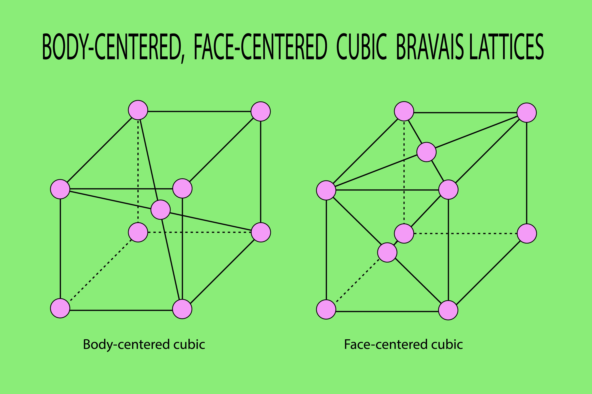

-----

# 📘 Clase Maestra: Optimización en Grafos

**Temas:** Recubrimiento Mínimo (MST) y Coloración
**Objetivo:** Aprender a conectar puntos gastando lo mínimo y a organizar elementos sin conflictos.

-----

## 🏗️ Tema 4: Algoritmos de Recubrimiento Mínimo (MST)

### 1\. ¿Cuál es el problema? (La Analogía del Electricista)

imagina que eres un electricista. Tienes 5 casas (Nodos) y necesitas conectarlas todas a la red eléctrica. Tienes varias rutas posibles (Aristas), y cada ruta tiene un costo de cable diferente (Peso).

**Tu Misión:** Conectar TODAS las casas usando la menor cantidad de cable (dinero) posible.

  * **Regla de Oro:** No puedes dejar casas aisladas y **NO debes crear ciclos** (no necesitamos dar vueltas en círculo, solo conectar).
  * El resultado se llama **Árbol de Recubrimiento Mínimo (MST)**.

-----

### 2\. Solución A: Algoritmo de Kruskal (El Ahorrador)

**Estrategia:** "Busco las ofertas más baratas primero".

1.  Haces una lista de **todas** las aristas (conexiones) del mapa.
2.  Las ordenas de **MENOR a MAYOR** costo.
3.  Empiezas a elegir las más baratas.
4.  **OJO:** Si elegir una arista cierra un ciclo (conecta dos nodos que ya estaban conectados indirectamente), **la descartas**.

**Ejemplo Visual:**

  * Arista A-B (Costo 1): ¡La tomo\!
  * Arista C-D (Costo 2): ¡La tomo\!
  * Arista A-C (Costo 3): ¡La tomo\!
  * Arista B-D (Costo 4): **¡ALTO\!** Si uno B con D, se crea un ciclo (A-B-D-C-A). La descarto.

**Código C++ (Concepto con Estructuras):**
*Para Kruskal usamos una herramienta llamada "Union-Find" para detectar ciclos rápidamente.*

```cpp
struct Arista {
    int origen, destino, peso;
};

// Comparador para ordenar de menor a mayor
bool compararAristas(Arista a, Arista b) {
    return a.peso < b.peso;
}

void Kruskal(vector<Arista>& aristas, int numNodos) {
    // 1. ORDENAR por peso (Lo más barato primero)
    sort(aristas.begin(), aristas.end(), compararAristas);

    int costoTotal = 0;
    
    cout << "--- CONEXIONES ELEGIDAS (KRUSKAL) ---\n";
    
    // 2. Iterar sobre las aristas ordenadas
    for (Arista a : aristas) {
        // En código real, aquí usamos "find()" para ver si ya están conectados
        if (!formanCiclo(a.origen, a.destino)) { 
            cout << "Conectando " << a.origen << " - " << a.destino << " ($" << a.peso << ")\n";
            costoTotal += a.peso;
            unirConjuntos(a.origen, a.destino);
        }
    }
    cout << "Gasto Total Mínimo: $" << costoTotal << endl;
}
```

-----

### 3\. Solución B: Algoritmo de Prim (La Mancha de Aceite)

**Estrategia:** "Me expando desde donde estoy".

1.  Eliges un nodo inicial al azar (ej. Casa A).
2.  Miras **solo las conexiones que salen de tus casas ya conectadas**.
3.  Eliges la más barata que lleve a una casa **NUEVA** (no visitada).
4.  Repites hasta conectar todo.

**Diferencia Clave:**

  * **Kruskal:** Salta por todo el mapa buscando lo barato (Global).
  * **Prim:** Crece ordenadamente desde un punto (Local).

-----

## 🎨 Tema 5: Coloración de Grafos

### 1\. ¿Cuál es el problema? (El Mapa Político)

Tienes un mapa de países. Quieres pintarlos de modo que **ningún país vecino tenga el mismo color**.

  * **Reto:** Usar la menor cantidad de colores posible.
  * **Número Cromático:** Es ese número mínimo de colores necesarios.



### 2\. Algoritmo Greedy (El Avaricioso)

Es la forma más rápida y sencilla, aunque no siempre da el mínimo perfecto, funciona muy bien.

**Lógica:**

1.  Tomas el primer nodo.
2.  Le asignas el primer color disponible (Color 1).
3.  Pasas al siguiente nodo. Miras a sus vecinos ya pintados.
4.  Le asignas el color más bajo que **NO** estén usando sus vecinos.

**Ejemplo Visual:**

  * Nodo A: Le pongo **ROJO**.
  * Nodo B (Vecino de A): No puedo usar Rojo. Le pongo **AZUL**.
  * Nodo C (Vecino de A y B): No puedo Rojo ni Azul. Le pongo **VERDE**.
  * Nodo D (Vecino solo de A): No puedo Rojo. ¿Puedo Azul? Sí. Le pongo **AZUL**.

**Código C++ (Visualizador):**

```cpp
void ColorearGreedy(int numNodos, vector<int> adj[]) {
    int resultado[numNodos];
    
    // 1. Inicializar: Nadie tiene color (-1)
    resultado[0] = 0; // Al primer nodo le damos color 0
    for (int u = 1; u < numNodos; u++)
        resultado[u] = -1;

    // Arreglo para marcar colores ocupados por vecinos
    bool colorDisponible[numNodos]; 
    for (int i = 0; i < numNodos; i++) colorDisponible[i] = true;

    // 2. Colorear el resto
    for (int u = 1; u < numNodos; u++) {
        
        // A. Mirar vecinos y marcar sus colores como NO disponibles
        for (int vecino : adj[u]) {
            if (resultado[vecino] != -1) {
                colorDisponible[resultado[vecino]] = false;
            }
        }

        // B. Buscar el primer color libre
        int color;
        for (color = 0; color < numNodos; color++) {
            if (colorDisponible[color] == true) break;
        }

        resultado[u] = color; // Asignar color

        // C. Resetear disponibles para la siguiente vuelta
        for (int i = 0; i < numNodos; i++) colorDisponible[i] = true; 
    }

    // Imprimir
    for (int u = 0; u < numNodos; u++)
        cout << "Nodo " << u << " ---> Color " << resultado[u] << endl;
}
```

### 3\. Algoritmo de Brelaz (DSatur) - Nivel Experto

El algoritmo Greedy a veces falla si el orden de los nodos es malo. **Brelaz** es más inteligente porque elige **QUÉ nodo pintar primero**.

**Estrategia (Grado de Saturación):**

1.  En lugar de ir en orden (0, 1, 2...), eliges el nodo con **más vecinos ya coloreados con colores distintos**.
2.  ¿Por qué? Porque ese nodo es el más "difícil" o restringido. Mejor resolverlo pronto.
3.  Si hay empate, eliges el que tenga más vecinos en total (Grado).

-----

## 🛠️ Ejercicio Práctico

Dibuja 4 nodos formando un cuadrado (A, B, C, D) y una diagonal cruzada (A con C).

1.  **MST:**
      * Ponle pesos: A-B(1), B-C(2), C-D(3), D-A(4), A-C(10).
      * Ejecuta **Kruskal** mentalmente: ¿Qué aristas eliges? (Recuerda: ¡no ciclos\!).
2.  **Coloración:**
      * Intenta pintar ese grafo.
      * A (Color 1).
      * B es vecino de A -\> (Color 2).
      * C es vecino de A y B -\> (Color ?).

-----
