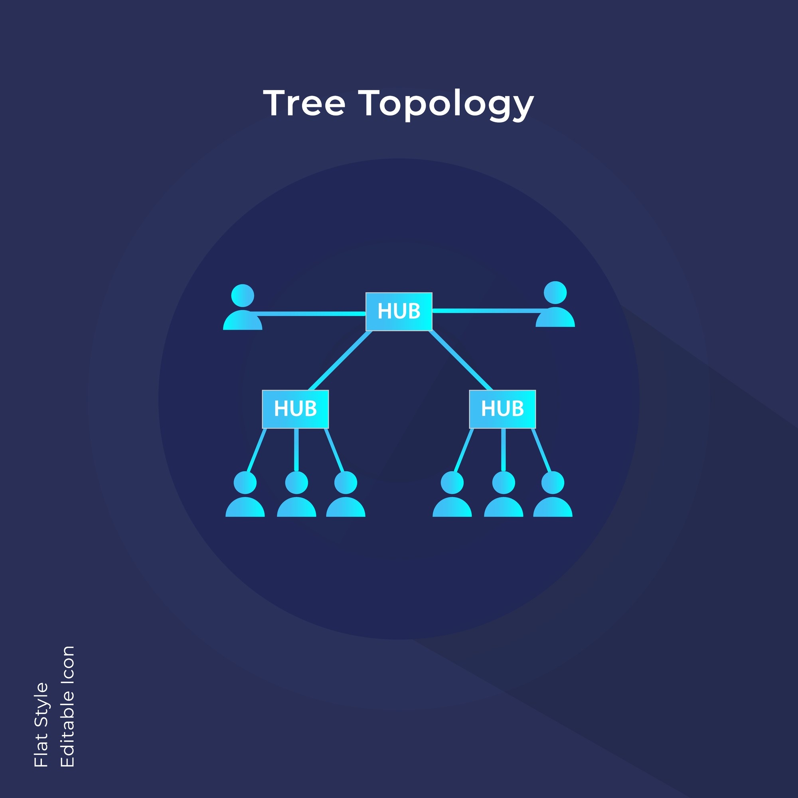
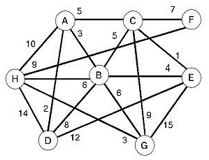

-----

# 📘 Unidad Avanzada: Árboles Especiales y Grafos

Esta guía cubre los temas clave para el **Quiz 2** y el inicio del **Parcial 2**. El objetivo es entender la estructura visualmente antes de programar la lógica compleja.

-----

## 1\. Árboles Montículo (Heaps) 🏔️

### ¿Qué son?

Imagina una pirámide militar estricta. A diferencia de un árbol binario normal donde los datos van a la izquierda o derecha según su valor, aquí lo único que importa es **quién está arriba**.

Existen dos tipos:
[100, 90, 80, 40, 50, 10]

  * **Max-Heap:** El "Jefe" (Padre) siempre debe ser **MAYOR** que sus subordinados (Hijos). El número más grande siempre está en la raíz.
  * **Min-Heap:** El Padre siempre es **MENOR**. El número más pequeño está en la raíz.

### Visualización (Max-Heap)

Observa cómo el `100` domina a todos. No importa si el `40` está a la izquierda o derecha del `90`, lo que importa es que ambos son menores que el `90`.
Además, el árbol siempre se llena de **izquierda a derecha** sin dejar huecos.

```text
       [100]  <-- RAÍZ (El Máximo)
      /     \
    [90]    [80]
    /  \    /
  [40][50][10] 
```

### Cómo se ve en Código (El Truco del Array)

Aunque lo dibujamos como un árbol, en C++ **no usamos punteros** para esto. Usamos un **Arreglo (Vector)** porque es mucho más rápido para ordenar (Heapsort).

La magia está en las matemáticas de los índices:

  * Si estoy en la posición `i`:
      * Mi **Hijo Izquierdo** está en: `2*i + 1`
      * Mi **Hijo Derecho** está en: `2*i + 2`

**Ejemplo en C++:**

```cpp
// El árbol de arriba representado en un arreglo simple
// Índices:  0    1   2   3   4   5
int heap[] = {100, 90, 80, 40, 50, 10};

// Si quiero hallar los hijos del 90 (que está en el índice 1):
// Izq = (2 * 1) + 1 = 3  --> En la pos 3 está el 40.
// Der = (2 * 1) + 2 = 4  --> En la pos 4 está el 50.
```

-----

## 2\. Caso de Estudio: Árbol de Merkle 🕵️‍♂️

### ¿Qué es?

Es un árbol usado en seguridad informática y Blockchain. No sirve para ordenar números, sino para **verificar la verdad**.

  * **Hojas:** Contienen los datos reales (archivos, transacciones).
  * **Padres:** No contienen datos, contienen una **Huella Digital (Hash)** formada por la combinación de sus hijos.

### Visualización

```text
    [ROOT HASH: ABC123]
         /    \
        /      \
    [Hash AB]    [Hash CD]
      /   \        /   \
     /     \      /     \
[Hash A][Hash B][Hash C][Hash D]
   |       |       |       |
 [Data1][Data2][Data3][Data4]  <-- Hojas (Datos Reales)
```



Si alguien modifica un dato abajo (una hoja), su huella cambia. Eso hace que la huella del padre cambie, y luego la del abuelo... hasta llegar a la raíz.
**Conclusión:** Si la huella de la raíz cambia, sabemos que el archivo fue modificado.

-----

## 3\. Grafos: La Red de Conexiones 🌐

Aquí rompemos las reglas. **No hay jerarquía**. No hay padres ni hijos.

  * **Nodos (Vértices):** Son los puntos (ciudades, personas).
  * **Aristas:** Son las líneas que los unen (carreteras, amistad).

### Formas de Representarlos en C++

Para el Parcial, necesitas saber cómo pasar ese dibujo a código. Hay dos formas principales:

#### A. Matriz de Adyacencia (La Tabla)

Es como un tablero de ajedrez o Excel. Usamos una matriz de `NxN`.

  * `1` = Hay conexión.
  * `0` = No hay conexión.

**Ejemplo C++:**

```cpp
// Grafo de 3 nodos (A, B, C)
// A conecta con B, C conecta con A
int matriz[3][3] = {
   // A  B  C
    { 0, 1, 0 }, // A
    { 0, 0, 0 }, // B
    { 1, 0, 0 }  // C
};
```

  * *Ventaja:* Es muy rápido saber si hay conexión.
  * *Desventaja:* Gasta mucha memoria si hay pocos caminos (lleno de ceros).

#### B. Lista de Adyacencia (La Agenda de Contactos)

**Esta es la más eficiente para programar recorridos.**
En lugar de una tabla gigante, tenemos un arreglo donde cada posición guarda una **Lista Enlazada** de sus vecinos.

**Visualmente:**

  * **Nodo A:** Tiene una lista -\> `[B] -> NULL`
  * **Nodo B:** Tiene una lista -\> `NULL` (Sin vecinos)
  * **Nodo C:** Tiene una lista -\> `[A] -> NULL`

  


**Ejemplo C++ (Estructura):**
Esta estructura te resultará familiar porque usamos Nodos y Punteros, como en las listas que ya dominas.

```cpp
// 1. El Nodo de la lista (Representa el destino de la conexión)
struct NodoAdyacente {
    int destino;            // ¿A qué nodo voy? (Ej: Ciudad 2)
    int peso;               // (Opcional) Distancia o costo
    NodoAdyacente* siguiente; // Puntero al siguiente vecino
};

// 2. El Grafo (Un arreglo de punteros)
// Cada posición del arreglo es el inicio de una lista enlazada
struct Grafo {
    int numVertices;
    NodoAdyacente* listaAdy[5]; // Arreglo para 5 nodos
};

// Así, listaAdy[0] tendrá la lista de todos los vecinos del Nodo 0.
```

-----

### Resumen para el Examen

1.  **Heaps (Montículos):** Úsalos para ordenar (**Heapsort**). Estructura estricta (Padre \> Hijo). Se programan con Arrays.
2.  **Merkle:** Árboles de Hashes para seguridad.
3.  **Grafos:** Redes libres. Usaremos **Listas de Adyacencia** (Arreglos de Listas) para programarlos porque ahorran memoria y son dinámicos.